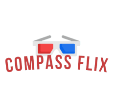
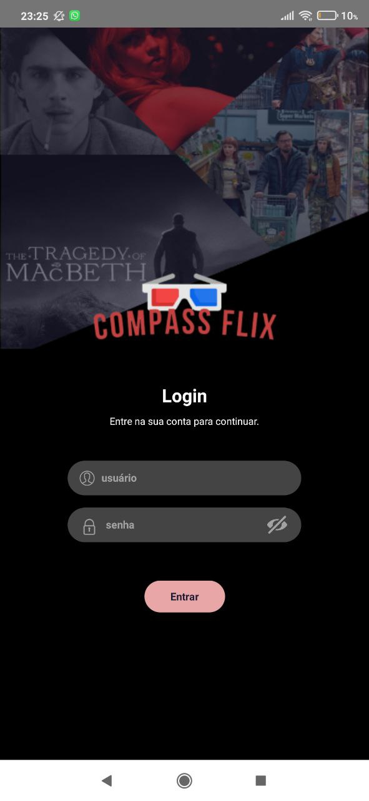
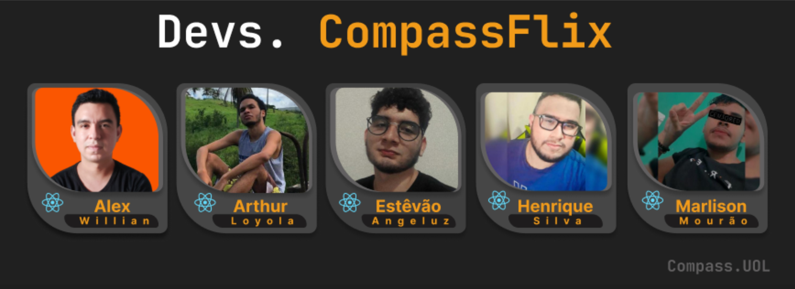

<h1 align="center"> CompassFlix </h1>  

    
  </a>

  Projeto Feito Pelo Time 1 da Compasso.Uol de React Native de Junho - Setembro de 2022

## Table of Contents

- [Introdução](#introdução)
- [Recursos](#Recursos)
- [Contribuidores](#contribuidores)
- [Processo para Buildar](#build-process)

<!-- END doctoc generated TOC please keep comment here to allow auto update -->

## Introdução

Aplicativo totalmente funcional de gerenciamento de filmes, feito totalmente em React Native e com a API do The Movie Database API, feita totalmente sem usar nem aparato pago.

**Disponivel Para Android**

  

## Recursos

Algumas das coisas que você pode fazer com o CompassFlix:

* Ver os Filmes e Series disponiveis na Api 
* Adicionar filmes a uma lista especifica de sua cricao 
* Adicionar Filmes ou Series aos seus favoritos
* Dar suas propia nota ao Filme ou Series
* Pode ver o elenco Principal do Filmes

  

## Contribuidores

  

## Build Process

- Entre no [React Native Guide](https://reactnative.dev/docs/environment-setup) para começar a construir um projeto com código nativo. **Um Mac é necessário se você deseja desenvolver para iOS.**
- Clone ou Baixe o repositorio
- `yarn` ou `npm` para instalar as dependecias
- `npx react-native run-android` para inicar o projeto 

**Development Keys**: Voce precisa criar uma conta no site [MovieDB](https://www.themoviedb.org)

